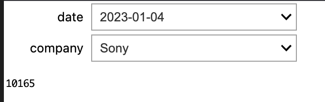

# 2023-Simple-StockData

sample webpage on github

Use Google Colaboratory: Simple StockData scraping from stooq.com - SoftBank

---

# 課題

## ~4/26

- 事前に、他の Virtual Trade システムなどをながめてくる
  - [Yahoo! finance](https://finance.yahoo.com/quote/AAPL?p=AAPL&.tsrc=fin-srch)の Apple Inc.
- まずは、自分用レポジトリで開発する。git&github の使い方の練習。（コードの共有は別途考える）
  - グラフ化
  - Scrapbox か Google Colab か？
- 必要な機能は？列挙する（最初の 15~30 分で共有）
  - 前日比、前日との差
  - グラフ化
  - 平均値
  - 期間の選択

## 4/27~

- 機能の実装
  - マーケティング情報の配信
  - ランキング
  - テクニカル指標のグラフ
  - 株価アラート
  - データのバックアップ機能
  - ポートフォリオ(各自の DB)

### ~5/10

- 6 つの株価を比較したランキングを表示

### ~5/24

- 日時を指定して価格を表示
- index にない日時は表示なし

